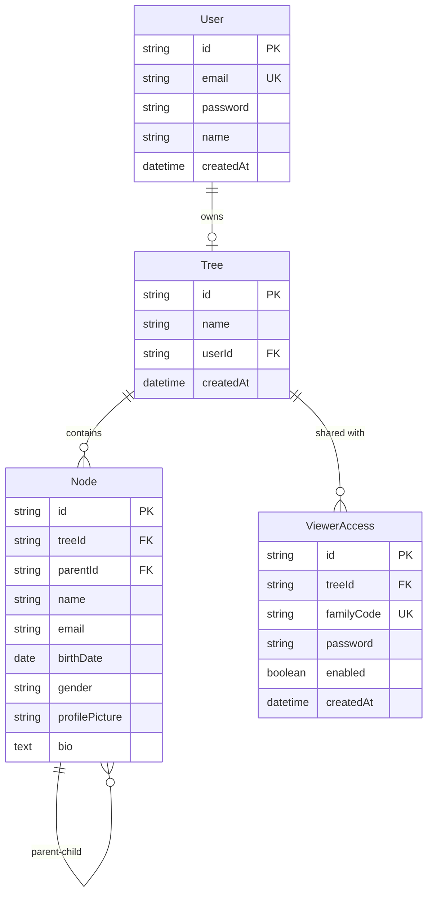

# 🌳 MeruVansh - Family Tree Management Platform

<div align="center">

**A modern, secure, and intuitive family tree management platform built with Next.js 14**

[](https://github.com/vkotiyal/meruvansh/actions/workflows/ci.yml)
[](https://nextjs.org/)
[](https://www.typescriptlang.org/)
[](https://www.prisma.io/)
[](https://www.postgresql.org/)
[](https://tailwindcss.com/)
[](https://opensource.org/licenses/MIT)

[Live Demo](https://meruvansh.vercel.app/) · [Report Bug](https://github.com/vkotiyal/meruvansh/issues) · [Request Feature](https://github.com/vkotiyal/meruvansh/issues)

</div>

---

## 📖 Table of Contents

- [About](#-about)
- [Features](#-features)
- [Tech Stack](#️-tech-stack)
- [Getting Started](#-getting-started)
- [Project Structure](#-project-structure)
- [Architecture](#️-architecture)
- [Contributing](#-contributing)
- [License](#-license)

---

## 🎯 About

**MeruVansh** (मेरु वंश — "Meru" is Garhwali for "My", "Vansh" means "Lineage") is a full-stack web application that enables users to create, manage, and visualize their family genealogy. Built with modern web technologies, it emphasizes **security**, **performance**, and **user experience**.

### Why This Project?

Family trees are complex graph data structures that present unique challenges:

- **Recursive relationships**: Parent-child hierarchies with unlimited depth
- **Data integrity**: Preventing circular references and orphaned nodes
- **Visualization**: Rendering large trees with thousands of nodes performantly
- **Access control**: Managing who can view and edit family information

This project demonstrates proficiency in:

- ✅ Full-stack TypeScript development
- ✅ Complex database schema design (recursive relationships)
- ✅ Authentication & authorization
- ✅ Graph visualization algorithms
- ✅ Performance optimization
- ✅ Production deployment

---

## ✨ Features

### Core Functionality

- 🔐 **Secure Authentication** - Dual login: Admin (email) & Family Viewer (access code)
- 👥 **Role-Based Access Control** - Admin and Viewer roles with granular permissions
- 🔑 **Family Access Codes** - Share your tree with read-only access for family members
- 👤 **User Profiles** - Customizable user accounts with profile pictures
- 🌲 **Family Tree Creation** - Add, edit, and organize family members (Admin only)
- 📊 **Interactive Visualization** - Dynamic tree rendering with React Flow
- 🖼️ **Profile Pictures** - Image upload with Cloudinary integration
- 🔍 **Search & Filter** - Find family members quickly
- 📱 **Responsive Design** - Works on desktop, tablet, and mobile with hamburger navigation

### Technical Features

- ⚡ **Server-Side Rendering (SSR)** - Fast initial page loads
- 🎨 **Modern UI Components** - Shadcn/ui + Radix UI with custom loading states
- 🔒 **Type-Safe API** - End-to-end TypeScript with Zod validation
- 📐 **Database Migrations** - Version-controlled schema changes with Prisma
- 🛡️ **Security** - JWT authentication, bcrypt password hashing, RBAC
- 🎯 **UX Improvements** - Loading buttons, empty states, toast notifications
- 🚀 **CI/CD Pipeline** - Automated deployment with GitHub Actions
- 🌐 **SEO Optimized** - Meta tags, OpenGraph, sitemap

---

## 🛠️ Tech Stack

### Frontend

- **Framework**: [Next.js 14](https://nextjs.org/) (App Router)
- **Language**: [TypeScript](https://www.typescriptlang.org/)
- **Styling**: [Tailwind CSS](https://tailwindcss.com/)
- **UI Components**: [Shadcn/ui](https://ui.shadcn.com/) + [Radix UI](https://www.radix-ui.com/)
- **Visualization**: [React Flow](https://reactflow.dev/)
- **State Management**: React Hooks + Context API
- **Forms**: [React Hook Form](https://react-hook-form.com/) + [Zod](https://zod.dev/)

### Backend

- **Runtime**: [Node.js 20 LTS](https://nodejs.org/)
- **API**: Next.js API Routes
- **Authentication**: [NextAuth.js](https://next-auth.js.org/)
- **ORM**: [Prisma](https://www.prisma.io/)
- **Validation**: [Zod](https://zod.dev/)

### Database & Storage

- **Database**: [PostgreSQL 16](https://www.postgresql.org/) (Neon.tech)
- **Image Storage**: [Cloudinary](https://cloudinary.com/)

### DevOps & Tools

- **Deployment**: [Vercel](https://vercel.com/)
- **CI/CD**: [GitHub Actions](https://github.com/features/actions)
- **Version Control**: Git + GitHub
- **Package Manager**: npm
- **Linting**: ESLint + Prettier
- **Git Hooks**: Husky + lint-staged
- **Commit Convention**: Conventional Commits

---

## 🚀 Getting Started

### Prerequisites

- **Node.js** 20.x or higher
- **PostgreSQL** 16.x (or Neon.tech account)
- **Cloudinary** account (free tier)

### Installation

1. **Clone the repository**

   ```bash
   git clone https://github.com/vkotiyal/meruvansh.git
   cd meruvansh
   ```

2. **Install dependencies**

   ```bash
   npm install
   ```

3. **Set up environment variables**

   ```bash
   cp .env.example .env.local
   ```

   Fill in the required values:
   - `DATABASE_URL`: Your PostgreSQL connection string
   - `NEXTAUTH_SECRET`: Generate with `openssl rand -base64 32`
   - `NEXT_PUBLIC_CLOUDINARY_CLOUD_NAME`: From Cloudinary dashboard
   - Other Cloudinary credentials

4. **Initialize the database**

   ```bash
   npx prisma generate
   npx prisma db push
   ```

5. **Run the development server**

   ```bash
   npm run dev
   ```

6. **Open in browser**
   Navigate to [http://localhost:3000](http://localhost:3000)

### Database Setup (Neon.tech)

1. Sign up at [neon.tech](https://neon.tech)
2. Create a new project
3. Copy the connection string
4. Add to `.env.local` as `DATABASE_URL`

### Cloudinary Setup

1. Sign up at [cloudinary.com](https://cloudinary.com)
2. Go to Dashboard → Settings → Upload
3. Create upload preset named "meruvansh" (unsigned)
4. Copy Cloud Name, API Key, and API Secret
5. Add to `.env.local`

---

## 📁 Project Structure

```
meruvansh/
├── app/              # Next.js App Router (pages, layouts, API routes)
├── components/       # React components (UI, features, providers)
├── lib/              # Utilities (auth, database, env config)
├── hooks/            # Custom React hooks
├── prisma/           # Database schema
├── types/            # TypeScript type definitions
├── public/           # Static assets
├── docs/             # Additional documentation
└── .github/          # CI/CD workflows, issue templates
```

For detailed file structure, see the [docs/](./docs/) folder.

---

## 🏗️ Architecture

### Database Schema



### Authentication Flow

```
Admin User → Login (email + password) → NextAuth → User table → JWT (role: admin) → Full Access
Family Member → Login (familyCode + password) → NextAuth → ViewerAccess table → JWT (role: viewer) → Read-Only Access
```

### Access Control

The application implements Role-Based Access Control (RBAC) with two roles:

- **Admin** (Tree Owner)
  - Full CRUD operations on tree and members
  - Create and manage family access codes
  - View all settings and analytics
  - Cannot be deleted if they own the tree

- **Viewer** (Family Member)
  - Read-only access to tree visualization
  - View all family members
  - Cannot add, edit, or delete anything
  - Login using shared family code + password

Access codes can be:

- Created by admins with unique family codes (e.g., "sharma2026")
- Enabled/disabled dynamically
- Password-protected (bcrypt hashed)
- Shared with multiple family members

### Tree Visualization Algorithm

The tree layout uses a **hierarchical positioning algorithm**:

1. **Identify root nodes** (nodes without parents)
2. **Calculate levels** recursively (depth-first traversal)
3. **Position nodes** using a width-balanced approach
4. **Render with React Flow** for zoom, pan, and interactions

---

## 🧪 Testing

```bash
# Run all tests
npm test

# Run tests in watch mode
npm run test:watch

# Generate coverage report
npm run test:coverage
```

---

## 🚢 Deployment

### Deploy to Vercel (Recommended)

1. Push code to GitHub
2. Import project in Vercel
3. Add environment variables
4. Deploy!

[](https://vercel.com/new/clone?repository-url=https://github.com/vkotiyal/meruvansh)

### Manual Deployment

```bash
# Build for production
npm run build

# Start production server
npm start
```

---

## 🤝 Contributing

Contributions are welcome! We appreciate all contributions, from bug reports to new features.

**Please read our [Contributing Guidelines](.github/CONTRIBUTING.md) before getting started.**

### Quick Start for Contributors

1. Fork the repository
2. Create a feature branch (`git checkout -b feature/amazing-feature`)
3. Commit changes using [Conventional Commits](https://www.conventionalcommits.org/)
4. Push to the branch (`git push origin feature/amazing-feature`)
5. Open a Pull Request using our [PR template](.github/pull_request_template.md)

### Useful Links

- [Contributing Guide](.github/CONTRIBUTING.md) - Detailed contribution instructions
- [Code of Conduct](.github/CONTRIBUTING.md#code-of-conduct)
- [Development Setup](.github/CONTRIBUTING.md#development-setup)
- [Security Policy](.github/SECURITY.md)

---

## 📝 License

This project is licensed under the **MIT License** - see the [LICENSE](LICENSE) file for details.

---

## 👨‍💻 Author

Vaibhav Kotiyal

- GitHub: [@vkotiyal](https://github.com/vkotiyal)
- LinkedIn: [Vaibhav Kotiyal](https://linkedin.com/in/vkotiyal)
- Portfolio: [vaibhavkotiyal.com](https://vaibhavkotiyal.com)

---

## 🙏 Acknowledgments

- [Next.js](https://nextjs.org/) team for the amazing framework
- [Vercel](https://vercel.com/) for free hosting
- [Shadcn](https://ui.shadcn.com/) for beautiful UI components
- [Prisma](https://www.prisma.io/) for the excellent ORM
- [Neon](https://neon.tech/) for serverless PostgreSQL

---

<div align="center">

**⭐ Star this repo if you find it helpful!**

Made with ❤️ and ☕ by Vaibhav Kotiyal

</div>
