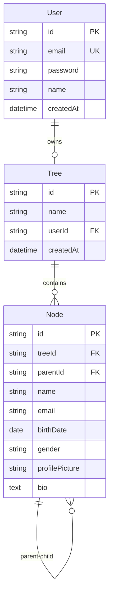

# 🌳 VanshVriksh - Family Tree Management Platform

<div align="center">


**A modern, secure, and intuitive family tree management platform built with Next.js 14**

[](https://nextjs.org/)
[](https://www.typescriptlang.org/)
[](https://www.prisma.io/)
[](https://www.postgresql.org/)
[](https://tailwindcss.com/)

[Live Demo](#) · [Report Bug](https://github.com/yourusername/vanshvriksh/issues) · [Request Feature](https://github.com/yourusername/vanshvriksh/issues)

</div>

---

## 📖 Table of Contents

- [About](#about)
- [Features](#features)
- [Tech Stack](#tech-stack)
- [Getting Started](#getting-started)
- [Project Structure](#project-structure)
- [Architecture](#architecture)
- [Contributing](#contributing)
- [License](#license)

---

## 🎯 About

**VanshVriksh** (Sanskrit: वंशवृक्ष, meaning "Family Tree") is a full-stack web application that enables users to create, manage, and visualize their family genealogy. Built with modern web technologies, it emphasizes **security**, **performance**, and **user experience**.

### Why This Project?

Family trees are complex graph data structures that present unique challenges:
- **Recursive relationships**: Parent-child hierarchies with unlimited depth
- **Data integrity**: Preventing circular references and orphaned nodes
- **Visualization**: Rendering large trees with thousands of nodes performantly
- **Access control**: Managing who can view and edit family information

This project demonstrates proficiency in:
- ✅ Full-stack TypeScript development
- ✅ Complex database schema design (recursive relationships)
- ✅ Authentication & authorization
- ✅ Graph visualization algorithms
- ✅ Performance optimization
- ✅ Production deployment

---

## ✨ Features

### Core Functionality
- 🔐 **Secure Authentication** - Email/password with NextAuth.js
- 👤 **User Profiles** - Customizable user accounts
- 🌲 **Family Tree Creation** - Add, edit, and organize family members
- 📊 **Interactive Visualization** - Dynamic tree rendering with React Flow
- 🖼️ **Profile Pictures** - Image upload with Cloudinary integration
- 🔍 **Search & Filter** - Find family members quickly
- 📱 **Responsive Design** - Works on desktop, tablet, and mobile

### Technical Features
- ⚡ **Server-Side Rendering (SSR)** - Fast initial page loads
- 🎨 **Modern UI Components** - Shadcn/ui + Radix UI
- 🔒 **Type-Safe API** - End-to-end TypeScript
- 📐 **Database Migrations** - Version-controlled schema changes
- 🧪 **Testing** - Unit and integration tests
- 🚀 **CI/CD Pipeline** - Automated deployment with GitHub Actions
- 🌐 **SEO Optimized** - Meta tags, OpenGraph, sitemap

---

## 🛠️ Tech Stack

### Frontend
- **Framework**: [Next.js 14](https://nextjs.org/) (App Router)
- **Language**: [TypeScript](https://www.typescriptlang.org/)
- **Styling**: [Tailwind CSS](https://tailwindcss.com/)
- **UI Components**: [Shadcn/ui](https://ui.shadcn.com/) + [Radix UI](https://www.radix-ui.com/)
- **Visualization**: [React Flow](https://reactflow.dev/)
- **State Management**: React Hooks + [Zustand](https://zustand-demo.pmnd.rs/)
- **Forms**: [React Hook Form](https://react-hook-form.com/) + [Zod](https://zod.dev/)

### Backend
- **Runtime**: [Node.js 20 LTS](https://nodejs.org/)
- **API**: Next.js API Routes
- **Authentication**: [NextAuth.js](https://next-auth.js.org/)
- **ORM**: [Prisma](https://www.prisma.io/)
- **Validation**: [Zod](https://zod.dev/)

### Database & Storage
- **Database**: [PostgreSQL 16](https://www.postgresql.org/) (Neon.tech)
- **Image Storage**: [Cloudinary](https://cloudinary.com/)

### DevOps & Tools
- **Deployment**: [Vercel](https://vercel.com/)
- **CI/CD**: [GitHub Actions](https://github.com/features/actions)
- **Version Control**: Git + GitHub
- **Package Manager**: pnpm
- **Linting**: ESLint + Prettier
- **Git Hooks**: Husky + lint-staged
- **Commit Convention**: Conventional Commits

---

## 🚀 Getting Started

### Prerequisites

- **Node.js** 20.x or higher
- **pnpm** 8.x or higher
- **PostgreSQL** 16.x (or Neon.tech account)
- **Cloudinary** account (free tier)

### Installation

1. **Clone the repository**
   ```bash
   git clone https://github.com/yourusername/vanshvriksh.git
   cd vanshvriksh
   ```

2. **Install dependencies**
   ```bash
   pnpm install
   ```

3. **Set up environment variables**
   ```bash
   cp .env.example .env.local
   ```

   Fill in the required values:
   - `DATABASE_URL`: Your PostgreSQL connection string
   - `NEXTAUTH_SECRET`: Generate with `openssl rand -base64 32`
   - `NEXT_PUBLIC_CLOUDINARY_CLOUD_NAME`: From Cloudinary dashboard
   - Other Cloudinary credentials

4. **Initialize the database**
   ```bash
   pnpm prisma generate
   pnpm prisma db push
   ```

5. **Run the development server**
   ```bash
   pnpm dev
   ```

6. **Open in browser**
   Navigate to [http://localhost:3000](http://localhost:3000)

### Database Setup (Neon.tech)

1. Sign up at [neon.tech](https://neon.tech)
2. Create a new project
3. Copy the connection string
4. Add to `.env.local` as `DATABASE_URL`

### Cloudinary Setup

1. Sign up at [cloudinary.com](https://cloudinary.com)
2. Go to Dashboard → Settings → Upload
3. Create upload preset named "vanshvriksh" (unsigned)
4. Copy Cloud Name, API Key, and API Secret
5. Add to `.env.local`

---

## 📁 Project Structure

```
vanshvriksh/
├── app/                      # Next.js app directory (App Router)
│   ├── (auth)/              # Authentication routes (grouped)
│   │   ├── login/
│   │   └── signup/
│   ├── (dashboard)/         # Protected dashboard routes
│   │   └── dashboard/
│   │       ├── members/     # Member management
│   │       └── tree/        # Tree visualization
│   ├── api/                 # API routes
│   │   ├── auth/           # NextAuth endpoints
│   │   └── nodes/          # Node CRUD operations
│   ├── layout.tsx          # Root layout
│   └── page.tsx            # Landing page
├── components/              # React components
│   ├── ui/                 # Shadcn/ui components
│   ├── providers/          # Context providers
│   └── [feature]/          # Feature-specific components
├── lib/                    # Utility functions & configs
│   ├── auth.ts            # NextAuth configuration
│   ├── prisma.ts          # Prisma client singleton
│   └── utils.ts           # Helper functions
├── prisma/                 # Database schema & migrations
│   └── schema.prisma      # Prisma schema
├── public/                # Static assets
├── types/                 # TypeScript type definitions
├── .github/               # GitHub Actions workflows
│   └── workflows/
├── .husky/                # Git hooks
├── .eslintrc.json        # ESLint configuration
├── .prettierrc           # Prettier configuration
├── next.config.js        # Next.js configuration
├── tailwind.config.ts    # Tailwind CSS configuration
├── tsconfig.json         # TypeScript configuration
└── package.json          # Dependencies & scripts
```

---

## 🏗️ Architecture

### Database Schema



### Authentication Flow

```
User → Login Page → NextAuth → Database → JWT Token → Protected Routes
```

### Tree Visualization Algorithm

The tree layout uses a **hierarchical positioning algorithm**:

1. **Identify root nodes** (nodes without parents)
2. **Calculate levels** recursively (depth-first traversal)
3. **Position nodes** using a width-balanced approach
4. **Render with React Flow** for zoom, pan, and interactions

---

## 🧪 Testing

```bash
# Run all tests
pnpm test

# Run tests in watch mode
pnpm test:watch

# Generate coverage report
pnpm test:coverage
```

---

## 🚢 Deployment

### Deploy to Vercel (Recommended)

1. Push code to GitHub
2. Import project in Vercel
3. Add environment variables
4. Deploy!

[](https://vercel.com/new/clone?repository-url=https://github.com/yourusername/vanshvriksh)

### Manual Deployment

```bash
# Build for production
pnpm build

# Start production server
pnpm start
```

---

## 🤝 Contributing

Contributions are welcome! Please follow these guidelines:

1. Fork the repository
2. Create a feature branch (`git checkout -b feature/amazing-feature`)
3. Commit changes using [Conventional Commits](https://www.conventionalcommits.org/)
4. Push to the branch (`git push origin feature/amazing-feature`)
5. Open a Pull Request

### Commit Message Convention

```
feat: add new feature
fix: bug fix
docs: documentation changes
style: code formatting
refactor: code refactoring
test: add tests
chore: maintenance tasks
```

---

## 📝 License

This project is licensed under the **MIT License** - see the [LICENSE](LICENSE) file for details.

---

## 👨‍💻 Author

**Your Name**

- GitHub: [@yourusername](https://github.com/yourusername)
- LinkedIn: [Your LinkedIn](https://linkedin.com/in/yourprofile)
- Portfolio: [yourwebsite.com](https://yourwebsite.com)

---

## 🙏 Acknowledgments

- [Next.js](https://nextjs.org/) team for the amazing framework
- [Vercel](https://vercel.com/) for free hosting
- [Shadcn](https://ui.shadcn.com/) for beautiful UI components
- [Prisma](https://www.prisma.io/) for the excellent ORM
- [Neon](https://neon.tech/) for serverless PostgreSQL

---

<div align="center">

**⭐ Star this repo if you find it helpful!**

Made with ❤️ and ☕ by [Your Name]

</div>
